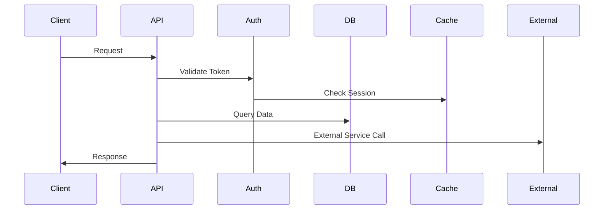
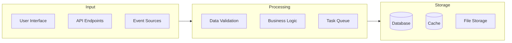
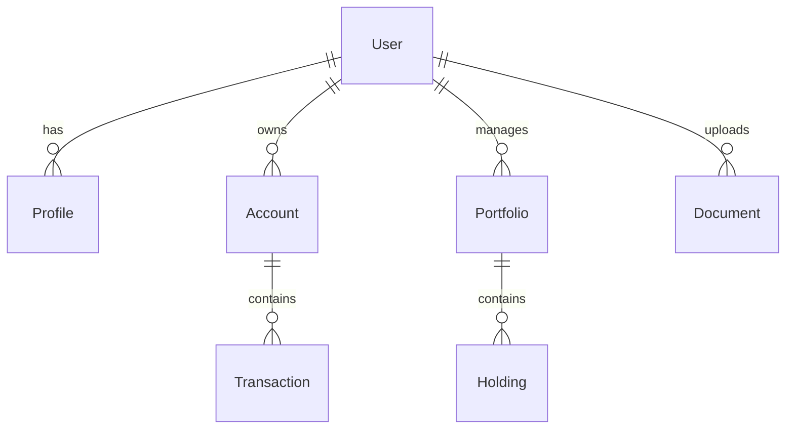
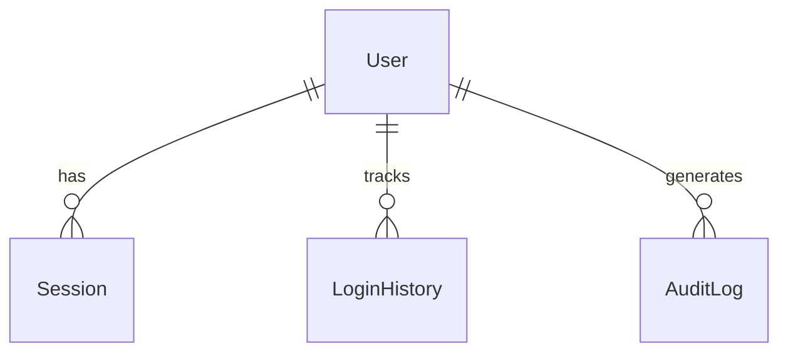

# Architecture Overview

## System Architecture

```mermaid
flowchart TB
    subgraph Client Layer
        Web[Web Application]
        Mobile[Mobile Apps]
        API[API Clients]
    end

    subgraph Load Balancing
        ALB[Application Load Balancer]
    end

    subgraph Application Layer
        API_Servers[API Servers]
        Workers[Background Workers]
    end

    subgraph Data Layer
        DB[(PostgreSQL)]
        Cache[(Redis)]
        Storage[S3 Storage]
    end

    subgraph External Services
        Market[Market Data API]
        Payment[Payment Gateway]
        Email[Email Service]
    end

    Client Layer --> ALB
    ALB --> Application Layer
    Application Layer --> Data Layer
    Application Layer --> External Services
```

## Component Interaction



## Data Flow



## Security Architecture

```mermaid
flowchart TB
    subgraph Security Layers
        WAF[Web Application Firewall]
        Auth[Authentication]
        RBAC[Role-Based Access]
        Encrypt[Encryption]
    end

    subgraph Monitoring
        Audit[Audit Logs]
        Alert[Alerting]
        Monitor[Monitoring]
    end

    Client --> WAF
    WAF --> Auth
    Auth --> RBAC
    RBAC --> Resources
    Resources --> Encrypt
    Security Layers --> Monitoring
```

## Technical Stack

### Frontend
- Next.js for server-side rendering
- React for UI components
- TailwindCSS for styling
- TypeScript for type safety

### Backend
- Node.js runtime
- Express.js framework
- Prisma ORM
- PostgreSQL database
- Redis caching

### Infrastructure
- AWS ECS for container orchestration
- AWS RDS for database
- AWS ElastiCache for Redis
- AWS S3 for storage
- CloudFront for CDN

### External Services
- Stripe for payments
- SendGrid for emails
- Market data providers

## System Components

### Authentication Service
- JWT token-based authentication
- Multi-factor authentication
- Session management
- Role-based access control

### Financial Service
- Portfolio management
- Transaction processing
- Market data integration
- Investment tracking

### Document Service
- Document storage and retrieval
- File format conversion
- Metadata management
- Version control

### Notification Service
- Email notifications
- Push notifications
- SMS alerts
- In-app messaging

## Data Models

### Core Entities


### Authentication Models


## API Design

### REST Endpoints
- Resource-based routing
- Standard HTTP methods
- Consistent response format
- Proper error handling

### GraphQL API
- Type-safe schema
- Efficient data fetching
- Real-time subscriptions
- Custom directives

## Scaling Strategy

### Horizontal Scaling
- Auto-scaling groups
- Load balancer distribution
- Read replicas
- Caching layers

### Vertical Scaling
- Instance sizing
- Resource optimization
- Performance tuning
- Memory management

## Monitoring & Observability

### Metrics Collection
- System metrics
- Business metrics
- User metrics
- Performance metrics

### Logging Strategy
- Centralized logging
- Log levels
- Log retention
- Log analysis

## Backup & Recovery

### Data Backup
- Automated backups
- Point-in-time recovery
- Cross-region replication
- Backup verification

### Disaster Recovery
- Recovery point objective (RPO)
- Recovery time objective (RTO)
- Failover procedures
- Business continuity

## Security Measures

### Network Security
- VPC configuration
- Security groups
- Network ACLs
- WAF rules

### Data Security
- Encryption at rest
- Encryption in transit
- Key management
- Access controls

## Performance Optimization

### Caching Strategy
- Multi-level caching
- Cache invalidation
- Cache warming
- Cache coherence

### Query Optimization
- Index optimization
- Query analysis
- Execution plans
- Performance monitoring
